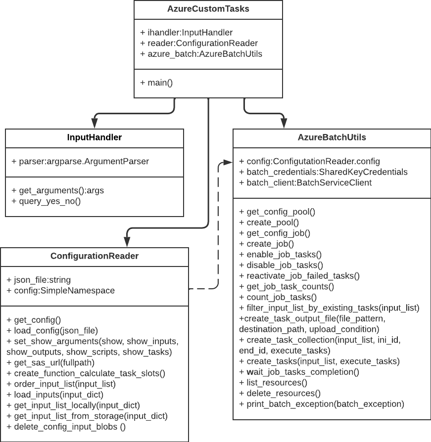

# Summary

Bioinformatics applications often encounter computational bottlenecks due to the vast volume of data generated by omics technologies. Cloud solutions like Microsoft Azure offer scalable infrastructures to manage these processing demands, but their complexity and associated costs can hinder adoption. Azure Custom Tasks (ACT) is a Python-based wrapper developed to simplify the deployment of parallelized bioinformatics tasks on Azure. By abstracting the complexities of the Azure Batch API, ACT reduces setup time through automated resource provisioning and simplified configuration, and lowers operational costs by optimizing task distribution and resource utilization, providing a scalable and reproducible solution. As an open-source tool under the MIT license, ACT minimizes technical barriers, promoting efficient and accessible large-scale data analysis in bioinformatics workflows. ACT's architecture is also suitable to other domains that require large-scale parallel data analysis, including fields such as physics, engineering, and data science, making it a versatile tool for diverse computational challenges.

# Statement of need

The exponential growth of omics technologies generates vast datasets, challenging computational biology, particularly regarding data processing and analysis [@DaSilva2019]. Cloud computing has emerged as a flexible, cost-effective solution, providing scalable access to computational resources without the need for physical infrastructure investments [@Sikeridis2017]. Despite this, the complexity of configuring and managing cloud environments—such as Microsoft Azure—remains a barrier to widespread adoption in bioinformatics [@Shanahan2014].

Azure Batch, a core Azure service for parallel computing, is well-suited for large-scale bioinformatics workflows. However, configuring and deploying tasks via Azure Batch requires managing complex parameters like virtual machines (VMs), input/output operations, and resource allocation [@Stein2010].

To simplify this process, we developed Azure Custom Tasks (ACT), an open-source Python wrapper that abstracts Azure Batch configurations. ACT enables researchers to leverage cloud scalability with minimal technical overhead, supporting reproducible and efficient bioinformatics workflows.

## Features

ACT is implemented in Python and leverages the Azure Batch API to simplify the deployment of parallelized bioinformatics tasks. Users can specify cloud resources, storage configurations, and task parameters via a single JSON configuration file. Key features include:

- **Centralized Configuration**: Simplifies deployment by centralizing parameters for Azure Batch resources (Pools, Jobs, Tasks) in a single JSON file, reducing the need for multiple API calls.
- **Comprehensive Azure Batch Support**: Provides streamlined access to essential Azure Batch features, simplifying task management and configuration.
- **Automatic Storage Mounting**: Automatically mounts Azure storage containers to compute nodes, facilitating direct reading and writing of input/output data.
- **Flexible Input Options**: Supports input data as storage blobs or local file strings, with customizable filtering based on task criteria.
- **Custom Resource Management**: Allows users to define functions in the configuration file to calculate required computing slots for tasks, optimizing resource usage and reducing operational costs.
- **Built-in Debugging**: Displays detailed information about task execution (inputs, outputs, scripts, and commands) for troubleshooting.
- **Custom Logging**: Provides detailed logs for monitoring task progress and profiling execution efficiency.

## Architecture

ACT follows a modular and layered architecture, where each component is designed to handle distinct aspects of task orchestration and execution on Microsoft Azure Batch (Figure 1). This architecture promotes separation of concerns and scalability, making ACT maintainable and extensible. The core components include:

- **AzureCustomTasks**: Manages task execution and resource provisioning.
- **InputHandler**: Handles input parsing and user interaction.
- **ConfigurationReader**: Loads configuration files and sets up authentication.
- **AzureBatchUtils**: Interfaces with Azure Batch to execute jobs and manage resources.

## Usage Information and Examples

Comprehensive documentation, including step-by-step setup instructions, configuration examples, and common use case scenarios, is available in the project's [Wiki Documentation](https://github.com/MeirellesLab/AzureCustomTasks/wiki)

# Acknowledgements

We would like to thank Larissa Depa and Larisse Depa for thorough backtesting of the wiki examples. 

# References

